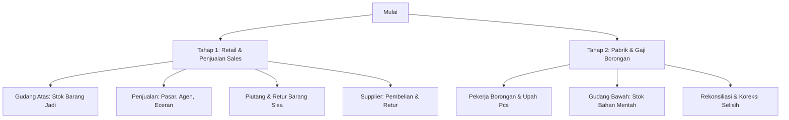

# Ringkasan Kebutuhan Sistem & Hasil Diskusi Klien (Sonia Paradise)

Dokumen ini disusun menggunakan bahasa non-teknis agar mudah dipahami oleh pemilik bisnis (Sonia), admin, dan seluruh tim operasional. Dokumen ini merangkum alur bisnis nyata yang perlu diakomodasi oleh sistem.

---

## 👥 1. Ringkasan Profil & Jalur Bisnis

Sonia Paradise (Produsen Sosis & Makanan Ringan) memiliki dua jalur utama dalam perolehan barang dagangan:

1.  **Produksi Sendiri:** Membuat produk makanan ringan (Makaroni, Jagung Marning, Kacang, dll.) dengan mempekerjakan tenaga borongan pembungkus di pabrik.
2.  **Barang Supplier:** Mengambil barang jadi dari pihak ketiga/supplier lain untuk langsung dijual kembali.

---

## 🔄 2. Rencana Pengembangan Bertahap (Phased Roadmap)

Berdasarkan diskusi terbaru, pengembangan sistem akan dibagi menjadi **2 Tahap Utama** dengan mendahulukan sistem penjualan retail dan stok barang jadi sebelum masuk ke sistem pabrik/borongan.

### 🏆 TAHAP 1: Retail, Penjualan Sales, & Stok Barang Jadi (PRIORITAS UTAMA)

Fokus pada pengelolaan stok barang siap jual, transaksi penjualan oleh sales, pengelolaan piutang pelanggan, dan transaksi dengan supplier.

#### A. Alur Gudang Barang Jadi (Gudang Atas)

- Mencatat stok barang jadi yang siap dijual (baik dari hasil produksi sendiri maupun dari supplier).
- Menghitung otomatis pengurangan stok setiap kali ada penjualan oleh sales atau eceran langsung di gudang.

#### B. Alur Penjualan & Pelayanan Pelanggan (3 Jalur)

- **Pasar:** Dijual ke pedagang pasar, dikirim menggunakan armada, dan invoice penjualan diinput oleh tim **Sales**.
- **Agen:** Dijual dalam partai besar ke agen tetap, dikirim menggunakan armada, dan invoice diinput oleh tim **Sales**.
- **Eceran Gudang:** Pembeli datang langsung ke gudang dan dilayani langsung oleh **Admin Gudang** secara instan di tempat.

#### C. Pembayaran Piutang & Retur Barang Sisa Pelanggan

- Pelanggan pasar/agen sering kali membayar tagihan piutang mereka menggunakan uang tunai ditambah dengan **Barang Sisa** (retur barang jadi yang tidak laku namun masih layak makan untuk diolah kembali).
- Nilai Barang Sisa yang diretur ini dihitung **sesuai harga jual asli barang tersebut** dan langsung mengurangi sisa hutang/piutang pelanggan tersebut.

#### D. Alur Transaksi Supplier (Buku Terpusat)

- Admin memiliki satu buku catatan khusus terpusat untuk mencatat barang masuk dari masing-masing supplier (dalam satuan _bal/dus/iket_), retur barang rusak ke supplier, serta catatan hutang pembelian kepada supplier tersebut yang langsung menambah/mengurangi stok Gudang Utama.

---

### 🏭 TAHAP 2: Sistem Pabrik, Bahan Baku Mentah, & Gaji Borongan (PENGEMBANGAN LANJUTAN)

Fokus pada alur produksi internal pabrik bawah, perhitungan gaji pekerja borongan, pencocokan data fisik, dan inventaris bahan mentah.

#### A. Upah Borongan Pekerja & Catatan Harian

- Pekerja borongan membungkus produk per pcs (Pak kecil) hingga dikemas dalam karung (Bal).
- Absensi dan hasil bungkus harian pekerja dicatat harian (Senin s.d. Minggu).
- Upah borongan dihitung per pcs berdasarkan kelas kemasan (Rp 500, Rp 1000, Rp 2000), ditambah uang makan & ongkos harian.

#### B. Pengurangan Stok Bahan Mentah (Gudang Bawah)

- Melacak stok bahan mentah (Kacang, Makaroni, Keripik Singkong, Jagung) di pabrik bawah.
- Mengurangi stok bahan mentah secara manual berdasarkan pemakaian aktual harian yang dilaporkan saat produksi selesai.

#### C. Rekonsiliasi & Koreksi Selisih Upah

- Pencocokan antara total hasil bungkus catatan pekerja vs fisik barang jadi yang benar-benar masuk ke gudang atas.
- Pencatatan koreksi selisih atas nama pekerja yang kelebihan tulis untuk langsung memotong gaji borongan mereka.

#### D. Konversi Sisa Produksi (Kolom Kantor)

- Admin mengumpulkan bungkusan kecil (Pak) sisa produksi di kantor hingga mencukupi untuk dibundel menjadi 1 Bal, kemudian menginputnya ke sistem untuk menambah stok barang jadi di gudang atas.

---

## 👥 3. Pembagian Tugas & Hak Akses Tim (Fokus Tahap 1)

### 1. Admin Gudang / Kantor (Akses Penuh)

- Mengawasi dan menginput stok barang jadi (Gudang Atas).
- Menginput pembayaran piutang pelanggan (termasuk potong piutang via retur Barang Sisa).
- Mencatat hutang pembelian, kiriman masuk, dan retur keluar ke supplier.
- Melayani langsung penjualan eceran yang datang ke gudang.

### 2. Sales (Akses Terbatas)

- Membuat invoice/nota penjualan untuk pelanggan Pasar dan Agen.
- Tidak bisa melihat modul keuangan admin, transaksi supplier, maupun stok modal.

### 3. Bagian Gudang Fisik & Kenek (Operasional Tanpa Komputer)

- Menyiapkan barang pesanan sales, merapikan barang jadi, dan menghitung fisik retur Barang Sisa dari pasar/agen untuk diserahkan ke Admin.

===

Oke, biar gak kepanjangan dan pusing, pengerjaan aplikasinya kita bagi jadi 2 tahap ya. Kita dulukan sistem penjualan & stok gudang atas (Retail/Sales) baru setelah itu masuk ke sistem pabrik.

Berikut pembagiannya:

TAHAP 1 (Fokus Utama Sekarang):

1. Stok Barang Jadi Gudang Atas: Mencatat stok barang yang siap dijual.
2. Penjualan: Penjualan Pasar & Agen (diinput sales lewat HP) serta Eceran langsung di gudang (diinput admin).
3. Piutang & Pembayaran: Mencatat tagihan toko, pembayaran cash, dan pemotongan piutang otomatis kalau ada retur Barang Sisa (dihitung seharga jual asli barangnya).
4. Buku Supplier Terpusat: Catatan kiriman masuk supplier, retur barang rusak ke supplier, dan catatan hutang kita ke supplier.

TAHAP 2 (Lanjutan Nanti):

1. Gaji Pekerja Borongan: Pembukuan absensi bungkus harian pekerja & hitungan upah per pcs (kemasan 500, 1000, 2000) plus uang makan/ongkos.
2. Rekonsiliasi & Koreksi: Dashboard pencocokan hasil bungkus pekerja vs barang masuk gudang + log potong gaji kalau pekerja salah catat.
3. Stok Bahan Mentah Gudang Bawah: Catatan sisa bahan mentah (kacang, jagung, dll) yang otomatis berkurang saat laporan produksi selesai.
4. 🏢 Sisa Bungkus Kecil (Kolom Kantor): Admin nyatuin bungkus kecil sisa produksi jadi 1 Bal utuh untuk ditambah ke stok gudang atas.

Apakah pembagian tahap 1 & 2 ini sudah pas dengan yang kamu bayangkan, Son? Biar tim developer langsung tancap gas buat Tahap 1 dulu. 👍
