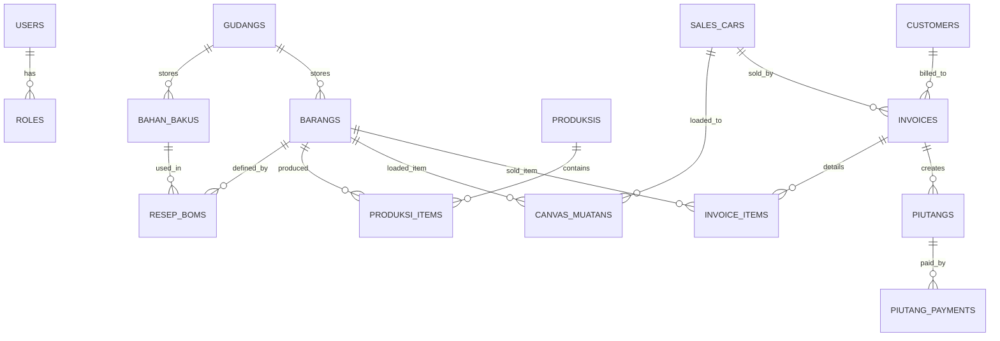

# Panduan Implementasi Sistem Distribusi & Manufaktur Snack
*Stack: Laravel 13 + Filament v5 + PostgreSQL*

Dokumen ini berisi rencana teknis, arsitektur database, dan panduan langkah demi langkah untuk membangun sistem manajemen stok, penjualan (canvaser), piutang, dan manufaktur snack ringan.

---

## 🏗️ 1. Desain Arsitektur Database (Schema & Migrations)

Untuk memastikan integritas data (stok tidak minus, piutang tidak salah hitung), kita akan membuat tabel-tabel berikut dengan PostgreSQL.



### A. Tabel Utama & Master Data
1. **`users`**: Menyimpan data login karyawan dan owner.
2. **`gudangs`**: Memisahkan jenis gudang (e.g., "Gudang Bahan Baku Utama", "Gudang Barang Jadi").
3. **`bahan_bakus`**: Persediaan bahan baku curah (tepung, minyak, bumbu, plastik).
4. **`barangs`**: Produk jadi snack ringan siap jual (Snack A, Snack B).
5. **`resep_boms`** (Bill of Materials): Resep produksi.
   * Kolom: `barang_id`, `bahan_baku_id`, `jumlah_dibutuhkan`.

### B. Tabel Produksi & Persediaan
6. **`produksis`**: Log aktivitas dapur/produksi.
   * Kolom: `kode_produksi`, `tanggal`, `status` (Pending, Selesai).
7. **`produksi_items`**: Detail produk yang dihasilkan & bahan baku yang dipotong.
8. **`sales_cars`**: Data armada sales canvas (e.g., "Mobil A - Budi", "Mobil B - Joko").
9. **`canvas_muatans`**: Pencatatan muatan barang jadi ke mobil di pagi hari.
10. **`canvas_returs`**: Pencatatan pengembalian barang sisa di sore hari.

### C. Tabel Transaksi & Keuangan
11. **`customers`**: Data pedagang pasar langganan (nama, pasar, limit kredit).
12. **`invoices`**: Nota penjualan yang diterbitkan sales canvaser.
    * Kolom: `no_invoice`, `customer_id`, `sales_car_id`, `total_harga`, `status_bayar` (Lunas, Kredit).
13. **`invoice_items`**: Detail snack terjual per nota.
14. **`piutangs`**: Kartu piutang customer.
    * Kolom: `invoice_id`, `nominal_piutang`, `nominal_terbayar`, `status` (Belum Lunas, Lunas).
15. **`piutang_payments`**: Log cicilan/pembayaran piutang dari customer.
16. **`hutangs`**: Kartu hutang pembelian bahan baku ke supplier besar.
17. **`activity_log`** (Spatie): Otomatis mencatat perubahan data untuk kebutuhan Audit Trail Owner.

---

## 🚀 2. Langkah-Langkah Setup Project

### Langkah 2.1: Inisialisasi Project Laravel (Versi 13.x)
*Pastikan lingkungan pengembangan Anda sudah menggunakan PHP 8.3+ dan Node.js 18+.*
Jalankan perintah berikut di terminal untuk membuat project baru:
```bash
composer create-project laravel/laravel stokbar-app
```

### Langkah 2.2: Install Filament v5 & Dependencies
Masuk ke direktori proyek dan install Filament v5 beserta Spatie Permission (untuk hak akses karyawan):
```bash
composer require filament/filament:"^5.0"
php artisan filament:install --panels

# Install Spatie Permission untuk hak akses (RBAC)
composer require spatie/laravel-permission
php artisan vendor:publish --provider="Spatie\Permission\PermissionServiceProvider"
```

### Langkah 2.3: Konfigurasi Database (PostgreSQL)
Buka file `.env` di project Anda, sesuaikan koneksi database:
```env
DB_CONNECTION=pgsql
DB_HOST=127.0.0.1
DB_PORT=5432
DB_DATABASE=stokbar_db
DB_USERNAME=postgres
DB_PASSWORD=your_secure_password
```

---

## 🔒 3. Implementasi Keamanan & Kebijakan Data (Policies)

Untuk menghentikan praktik owner melakukan kerja ulang karena kurang percaya staf, sistem menggunakan **Laravel Policies** pada Filament Resource untuk mengunci aksi modifikasi data:

```php
// app/Policies/InvoicePolicy.php

public function update(User $user, Invoice $invoice): bool
{
    // Sales HANYA bisa mengubah invoice jika statusnya masih 'draft' 
    // dan belum divalidasi oleh Keuangan/Gudang di sore hari.
    if ($user->hasRole('sales')) {
        return $invoice->status === 'draft';
    }
    
    // Admin Keuangan bisa mengedit, tetapi aksi dicatat oleh Spatie Activity Log.
    if ($user->hasRole('admin_keuangan')) {
        return true;
    }

    return false;
}

public function delete(User $user, Invoice $invoice): bool
{
    // HANYA Owner yang boleh menghapus nota penjualan/transaksi
    return $user->hasRole('owner');
}
```

---

## 🖥️ 4. Rancangan Halaman Dasbor Filament

### A. Tampilan Mobile (Untuk Sales Canvaser)
* Menggunakan fitur **Filament Simple Page** atau kustomisasi halaman form yang mobile-responsive.
* Halaman utama Sales berisi 3 tombol besar:
  1. **Muat Pagi:** Konfirmasi barang bawaan dari gudang.
  2. **Input Penjualan:** Scanner barcode/pilih snack -> Pilih Customer -> Input Tunai/Kredit -> Print Struk Thermal.
  3. **Setor Sore:** Tutup penjualan harian & input retur sisa barang.

### B. Tampilan Desktop (Untuk Owner & Admin)
* Menggunakan **Filament Widgets** untuk menampilkan:
  * Grafik Tren Penjualan Harian.
  * *Alert Card* jika ada stok bahan baku di bawah batas aman (*Safety Stock*).
  * Panel Persetujuan (*Approval Box*) untuk permohonan koreksi data dari staf gudang/sales.
  * Akses cepat ke **Log Audit Aktivitas** karyawan.

---

## 📅 5. Rencana Tahapan Pengembangan (Milestones)

1. **Minggu 1: Setup & Master Data**
   * Migrasi database, konfigurasi multi-gudang, master bahan baku, snack, customer, dan pembagian hak akses (RBAC).
2. **Minggu 2: Modul Manufaktur & Logistik**
   * Implementasi modul resep (BOM), proses produksi snack, modul muat & retur mobil sales canvaser.
3. **Minggu 3: Modul Penjualan & Keuangan**
   * Halaman penjualan mobile sales, cetak invoice, sistem piutang customer, pembayaran cicilan, dan pencatatan hutang supplier.
4. **Minggu 4: Dashboard, Audit Log & Live Testing**
   * Pembuatan dasbor statistik pimpinan, modul log aktivitas, dan uji coba alur kerja harian bersama calon staf klien.
