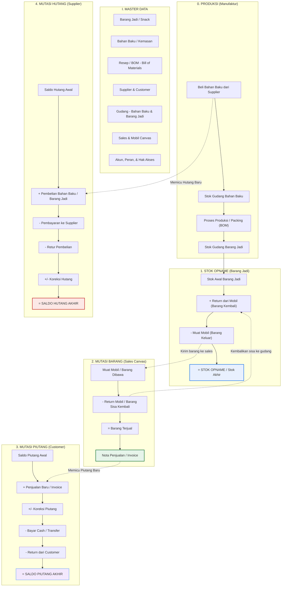

# Dokumen Perbaikan User Flow Sistem Distribusi & Manufaktur
*Berdasarkan Analisis Logika Bisnis, Akuntansi Standar, & Kebutuhan Klien Produsen Snack*

Dokumen ini mendokumentasikan perbaikan logika bisnis pada rancangan **User Flow Sistem Distribusi** serta pengembangannya ke arah **Sistem Produksi/Manufaktur** untuk klien Anda yang memproduksi dan menjual snack ringan ke pasar.

---

## 💼 Analisis Kecocokan Bisnis Klien

Berdasarkan profil calon klien Anda (produsen snack ringan yang menjual ke pedagang pasar secara berlangganan/baru), alur ini **sangat cocok** untuk memecahkan masalah utamanya:

1. **Masalah Excel & Ketakutan Data Diubah:**
   * **Solusi:** Sistem web/dashboard menggunakan database relasional yang dilindungi oleh **Role-Based Access Control (RBAC)** dan **Audit Trail**. Data tidak bisa diubah langsung seperti di Excel. Setiap perubahan (siapa, kapan, data sebelum & sesudah) akan tercatat otomatis di log sistem.
2. **Masalah Kurang Percaya (Mengerjakan Ulang Pekerjaan Karyawan):**
   * **Solusi:** Sistem akan menerapkan validasi ketat otomatis (*System-Enforced Rules*). Misalnya: sales tidak bisa input penjualan melebihi stok di mobilnya, kasir tidak bisa memotong piutang tanpa ada transaksi kas masuk yang valid, dll. Pemilik cukup memantau *Dashboard Audit* untuk melihat selisih pencatatan secara real-time daripada mengulang pekerjaan dari nol.
3. **Pembelian Bahan Baku vs Distribusi Barang Jadi:**
   * **Solusi (Ekspansi Baru):** Kami menambahkan pemisahan antara **Gudang Bahan Baku** (tepung, minyak, bumbu, kemasan) dan **Gudang Barang Jadi** (snack siap jual) serta menambahkan **Modul Produksi (Assembly)**.

---

## 📊 Visualisasi User Flow Baru (Mermaid Diagram)

Berikut adalah diagram alir sistem distribusi & produksi yang sudah diperbaiki secara logis:

---

## 📝 Penjelasan Detail Alur Kerja Bisnis Per Modul

### 0. Modul Produksi (Tambahan Khusus Produsen Snack)
* **Tujuan:** Mengelola konversi bahan baku curah menjadi produk snack ringan yang siap dipasarkan.
* **Alur Logis:**
  1. Pembelian **Bahan Baku** (minyak, tepung, bumbu, plastik kemasan) dicatat masuk ke **Gudang Bahan Baku**.
  2. Saat produksi berjalan, sistem memotong Stok Bahan Baku secara otomatis berdasarkan **Resep/BOM (Bill of Materials)** yang ditentukan (misal: 1 pcs Snack Pedas memotong 10gr tepung, 5gr bumbu, dan 1 pcs plastik).
  3. Hasil produksi (snack siap jual) dimasukkan sebagai penambah **Stok Gudang Barang Jadi**.
* **Output Sistem:** Laporan Mutasi Bahan Baku, Laporan Hasil Produksi Harian.

### 1. Modul Stok Opname (Persediaan Barang Jadi)
* **Tujuan:** Melacak persediaan produk snack siap jual di gudang utama.
* **Alur Logis:**
  1. Dimulai dari saldo stok awal barang jadi (hasil dari modul produksi).
  2. Bertambah jika sales mengembalikan barang sisa/tidak laku dari mobil.
  3. Berkurang saat memuat barang ke mobil sales untuk didistribusikan ke pasar.
  4. Stok akhir dicocokkan secara berkala melalui proses Stok Opname fisik.
* **Output Sistem:** Kartu Stok Barang Jadi, Laporan Selisih Stok Opname.

### 2. Modul Mutasi Barang (Sales Canvaser)
* **Tujuan:** Melacak pergerakan stok snack yang dibawa keliling oleh sales ke pasar.
* **Alur Logis:**
  1. Sales membawa sejumlah snack (barang muat) di pagi hari.
  2. Di sore hari, sisa snack yang tidak terjual di-retur kembali ke gudang utama.
  3. **Barang Terjual** dihitung: $\text{Barang Muat} - \text{Barang Sisa}$.
  4. Nota Penjualan diterbitkan sesuai dengan jumlah Barang Terjual tersebut (baik tunai maupun kredit/piutang).
* **Output Sistem:** Laporan Penjualan Sales per Hari, Nota Penjualan (Invoice).

### 3. Modul Mutasi Piutang (Customer Pasar)
* **Tujuan:** Mengelola tagihan toko/pedagang pasar langganan.
* **Alur Logis:**
  1. Tagihan bertambah saat ada Penjualan Baru dengan metode kredit.
  2. Tagihan berkurang saat customer membayar (baik dicicil, transfer bank, atau bayar cash ke sales).
  3. Tagihan berkurang saat ada retur barang rusak langsung dari toko customer.
  * *Catatan: Tidak ada pengurangan akibat "Barang Sisa Mobil" di sini untuk menghindari kesalahan hitung.*
* **Output Sistem:** Kartu Piutang per Toko, Laporan Piutang Jatuh Tempo (Aging).

### 4. Modul Mutasi Hutang (Supplier Bahan Baku)
* **Tujuan:** Mengelola hutang pembelian bahan baku curah dari supplier besar.
* **Alur Logis:**
  1. Hutang bertambah saat membeli bahan baku produksi secara tempo/kredit.
  2. Hutang berkurang saat perusahaan melakukan pembayaran ke supplier.
* **Output Sistem:** Laporan Umur Hutang Supplier.

---

## 🔒 Fitur Keamanan Pengganti "Kerja Ulang Owner" (Anti-Manipulasi)

Untuk memberikan ketenangan pikiran kepada pemilik (*owner*) agar tidak perlu melakukan pekerjaan dari nol lagi, sistem harus dilengkapi dengan:

1. **Role-Based Access Control (RBAC):**
   * **Staf Gudang:** Hanya bisa input barang masuk produksi dan muat mobil.
   * **Staf Sales:** Hanya bisa input transaksi penjualan di pasar.
   * **Staf Keuangan:** Hanya bisa mengonfirmasi pembayaran piutang/hutang.
   * **Owner/Pimpinan:** Memiliki hak akses penuh, persetujuan (*approval*) koreksi data, dan akses dasbor.
2. **Audit Trail (Log Aktivitas):**
   * Setiap aktivitas `CREATE`, `UPDATE`, atau `DELETE` dicatat oleh sistem:
     > `[07-07-2026 14:15] User: Andi (Sales) mengubah kuantiti Nota #102 dari 50 pcs menjadi 40 pcs (Alasan: Salah input).`
3. **Persetujuan Owner (Approval Flow):**
   * Transaksi sensitif seperti **Koreksi Piutang**, **Koreksi Stok**, atau **Hutang Baru** berstatus *Pending* sebelum disetujui (*Approve*) oleh Owner melalui dasbor pribadinya.

