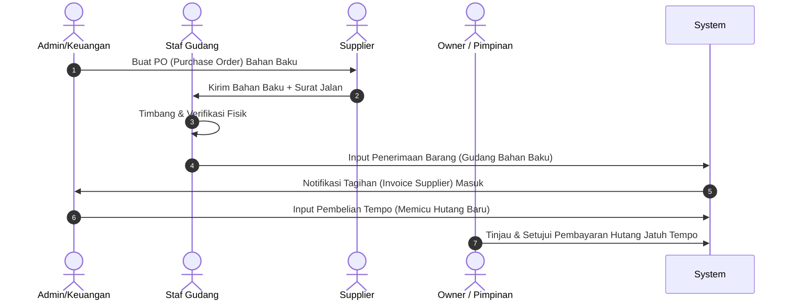
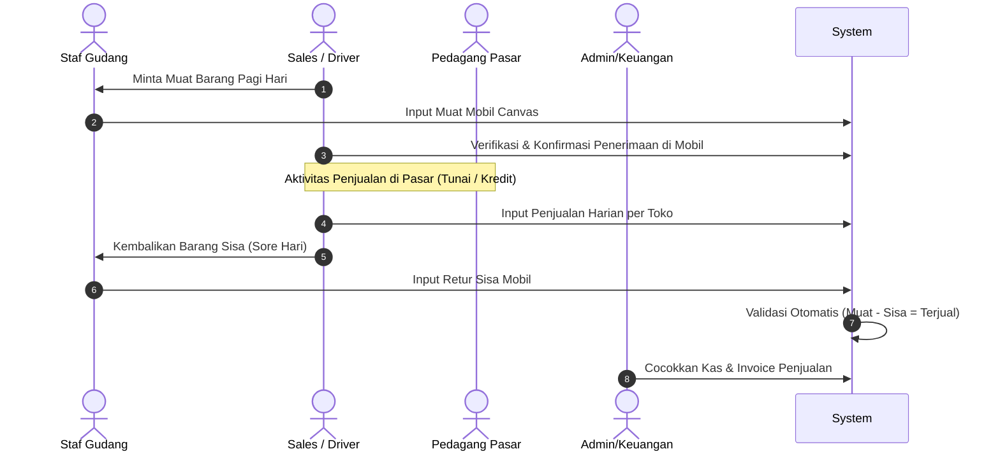

# Dokumen Analisis User Journey Sistem Distribusi & Manufaktur
*Rincian Perjalanan Pengguna Berdasarkan Peran (Role-Based User Journey)*

Dokumen ini memetakan perjalanan pengguna (*user journey*) secara rinci untuk setiap peran (*role*) di dalam ekosistem bisnis klien Anda. Pemetaan ini bertujuan untuk memastikan alur kerja harian berjalan mulus, aman dari manipulasi data, serta mengeliminasi pengerjaan ulang (*double-work*) oleh Owner.

---

## 👥 Profil Peran & Tanggung Jawab (Roles Profile)

| Peran (Role) | Tanggung Jawab Utama | Fokus Utama di Aplikasi |
| :--- | :--- | :--- |
| **Owner / Pimpinan** | Pengawasan keuangan, persetujuan transaksi sensitif, dan analisis bisnis. | Dashboard ringkasan, Log Audit, Approval Panel. |
| **Staf Gudang** | Mengelola stok bahan baku, mencatat hasil produksi, dan memuat/menerima barang sales. | Mutasi Stok Gudang, Stok Opname, Formulir Produksi. |
| **Sales / Driver Canvas** | Mendistribusikan snack, melayani penjualan pasar (tunai/kredit), dan menagih piutang. | Menu Canvaser (Muat, Jual, Retur Sisa), Riwayat Invoice. |
| **Admin / Keuangan** | Pencatatan hutang/pembelian bahan baku, pencocokan kas masuk, dan manajemen piutang. | Rekonsiliasi Kas, Kelola Hutang-Piutang, Verifikasi Invoice. |

---

## 📋 Rincian User Journey Harian Per Modul

### 1. Modul Produksi & Bahan Baku (Hutang Supplier)
*Menangani pembelian bahan baku curah dari supplier dan proses pembuatan snack.*



#### **A. Staf Gudang (Penerimaan & Produksi)**
* **Langkah 1 (Penerimaan):** Supplier datang mengirim tepung dan minyak. Staf Gudang mencocokkan fisik barang dengan surat jalan, lalu menginput jumlah masuk ke sistem pada menu **"Penerimaan Bahan Baku"**.
* **Langkah 2 (Produksi):** Saat proses menggoreng/mengemas snack dimulai, Staf Gudang membuka menu **"Mulai Produksi"**, memilih resep snack, dan menginput jumlah target produksi. Sistem otomatis memotong stok tepung, bumbu, dan plastik kemasan sesuai dengan Bill of Materials (BOM).
* **Langkah 3 (Penyimpanan):** Setelah snack dikemas, Staf Gudang menyimpan barang jadi di Gudang Barang Jadi dan mengonfirmasi **"Produksi Selesai"** di aplikasi untuk menambah stok barang jadi secara instan.

#### **B. Admin / Keuangan (Manajemen Hutang)**
* **Langkah 1 (Pencatatan):** Menerima invoice tagihan dari supplier bahan baku. Admin mencocokkannya dengan data penerimaan fisik dari Staf Gudang. Jika klop, Admin menginput transaksi **"Pembelian Kredit"** yang otomatis memicu saldo hutang baru ke supplier tersebut.
* **Langkah 2 (Pembayaran):** Saat jatuh tempo, Admin memproses transfer pembayaran ke supplier dan mengunggah bukti bayar ke sistem untuk melunasi saldo hutang.

#### **C. Owner / Pimpinan (Pengawasan)**
* **Langkah 1 (Validasi):** Owner memantau Laporan Pembelian dan sisa Hutang Supplier melalui dasbor. Owner tidak perlu menghitung ulang stok bahan baku di gudang karena sistem otomatis memvalidasi kesesuaian antara bahan baku yang dibeli dengan barang jadi yang diproduksi.

---

### 2. Modul Distribusi & Mutasi Barang (Sales Canvaser)
*Menangani proses sales mengambil snack ke mobil, berjualan di pasar, dan mengembalikan sisa.*



#### **A. Staf Gudang (Pelepasan & Penerimaan Sisa)**
* **Langkah 1 (Pagi Hari):** Membantu memuat karton snack ke dalam mobil sales. Gudang menginput data muatan ke sistem lewat menu **"Muat Mobil"**.
* **Langkah 2 (Sore Hari):** Menerima pengembalian snack yang tidak laku dari mobil sales. Staf Gudang menghitung fisik barang sisa dan menginputnya ke menu **"Retur Sisa Mobil"**.

#### **B. Sales / Driver Canvas (Penjualan Lapangan)**
* **Langkah 1 (Konfirmasi Pagi):** Membuka aplikasi di HP/tablet, memeriksa daftar muatan yang diinput staf gudang, lalu menekan tombol **"Konfirmasi Muatan"** jika fisik barang di mobil sudah sesuai.
* **Langkah 2 (Kunjungan Pasar):**
  * **Pelanggan Lama (Kredit):** Sales melayani pesanan toko, menginput penjualan tempo di aplikasi. Aplikasi secara otomatis mencetak struk/invoice digital dan memperbarui piutang toko tersebut.
  * **Pelanggan Baru (Tunai):** Sales menginput penjualan tunai dan langsung mengonfirmasi penerimaan uang kas.
* **Langkah 3 (Sore Hari):** Menyerahkan sisa barang ke gudang dan menyetor uang kas hasil penjualan hari itu ke bagian Keuangan.

#### **C. Admin / Keuangan (Rekonsiliasi Harian)**
* **Langkah 1 (Verifikasi Penjualan):** Meninjau menu rekonsiliasi harian. Sistem otomatis mencocokkan formula: $\text{Barang Terjual} = \text{Muat Pagi} - \text{Sisa Sore}$.
* **Langkah 2 (Verifikasi Kas):** Admin mencocokkan jumlah setoran uang tunai/transfer dari sales dengan total nominal penjualan tunai di sistem. Jika cocok, transaksi hari itu dinyatakan **"Closed"**.

---

### 3. Modul Manajemen Piutang & Penagihan (Customer)
*Menangani pemantauan tagihan pedagang pasar dan penagihan piutang.*

#### **A. Sales / Driver Canvas (Penagih Lapangan)**
* **Langkah 1 (Persiapan Rute):** Sebelum berangkat ke pasar, sales membuka menu **"Daftar Piutang Customer"** untuk melihat toko mana saja di rute hari itu yang memiliki tagihan jatuh tempo.
* **Langkah 2 (Penagihan):** Saat mengunjungi toko langganan, sales menagih piutang lama. Jika toko membayar, sales menginput pembayaran di menu **"Terima Bayar Piutang"** (memilih opsi Tunai atau Transfer). Struk tanda terima digital otomatis dikirim ke toko.

#### **B. Admin / Keuangan (Kontrol Kredit)**
* **Langkah 1 (Pencocokan Bank):** Memeriksa mutasi rekening koran perusahaan. Jika ada transfer piutang dari toko pasar, Admin mencari nama toko tersebut di sistem dan menekan tombol **"Verifikasi Pembayaran"** untuk melunasi piutang mereka.
* **Langkah 2 (Pengawasan Limit):** Sistem otomatis membatasi penjualan kredit baru jika suatu toko memiliki piutang yang melewati limit batas waktu atau limit nominal rupiah. Admin akan mendapatkan peringatan sistem jika sales mencoba menjual barang tempo ke toko yang menunggak.

#### **C. Owner / Pimpinan (Analisis Kredit Macet)**
* **Langkah 1 (Evaluasi):** Membuka **Laporan Aging Piutang** di dasbor untuk melihat toko-toko yang menunggak lebih dari 30/60/90 hari. Owner tidak perlu lagi mereka-reka piutang macet di Excel karena data piutang terkunci rapat dan diperbarui secara real-time berdasarkan setoran sales yang tervalidasi.

---

### 4. Modul Keamanan, Log Audit, & Koreksi Data (Pencegah Manipulasi)
*Menangani skenario jika terjadi kesalahan input atau kecurigaan manipulasi data.*

> [!NOTE]
> **Skenario Masalah:** 
> Staf Gudang salah menginput jumlah muatan mobil sales di pagi hari (misal terinput 100 bungkus padahal aslinya hanya 80 bungkus), dan kesalahan baru disadari sore hari. Di Excel, karyawan tinggal mengubah angka sesuka hati tanpa jejak. Di sistem baru, ada alur ketat untuk mencegah manipulasi.

#### **A. Karyawan yang Salah Input (Staf Gudang / Sales / Admin)**
* **Langkah 1:** Karyawan menyadari kesalahan input tetapi sistem mengunci transaksi yang sudah dikonfirmasi.
* **Langkah 2:** Karyawan membuka formulir **"Pengajuan Koreksi Data"**, memilih transaksi yang salah, menginput nilai perbaikan yang benar, dan menuliskan alasan wajib (contoh: *"Salah hitung dus pada muatan mobil B"*). Status transaksi berubah menjadi *Pending Approval Owner*.

#### **B. Owner / Pimpinan (Otoritas Penuh & Detektif Sistem)**
* **Langkah 1 (Approval):** Owner menerima notifikasi di dasbor pribadinya bahwa ada pengajuan koreksi data dari Staf Gudang.
* **Langkah 2 (Verifikasi):** Owner memverifikasi secara fisik/konfirmasi langsung. Jika disetujui, Owner menekan tombol **"Approve"**. Sistem secara otomatis memperbarui nilai stok/piutang dan mencatat persetujuan tersebut.
* **Langkah 3 (Audit Log):** Kapan saja Owner merasa curiga terhadap kinerja staf, Owner dapat membuka **Log Audit** untuk melihat seluruh riwayat hidup sistem. 

#### Contoh Log Audit yang Tersimpan di Sistem:
```
[07-07-2026 17:00] Gudang.Budi MEMBUAT transaksi Muat Mobil #MC-002 senilai 100 pcs.
[07-07-2026 17:05] Gudang.Budi MENGAJUKAN KOREKSI Muat Mobil #MC-002 menjadi 80 pcs. Alasan: "Salah input fisik".
[07-07-2026 17:10] Owner.Bambang MENYETUJUI KOREKSI Muat Mobil #MC-002 (Stok Gudang +20, Stok Mobil -20).
```
Dengan log audit yang tidak dapat dihapus atau dimodifikasi oleh siapa pun (bahkan oleh admin database sekalipun tanpa terekam log), Owner dapat **100% percaya pada data sistem** dan tidak perlu lagi mengerjakan ulang semua pencatatan dari awal.
